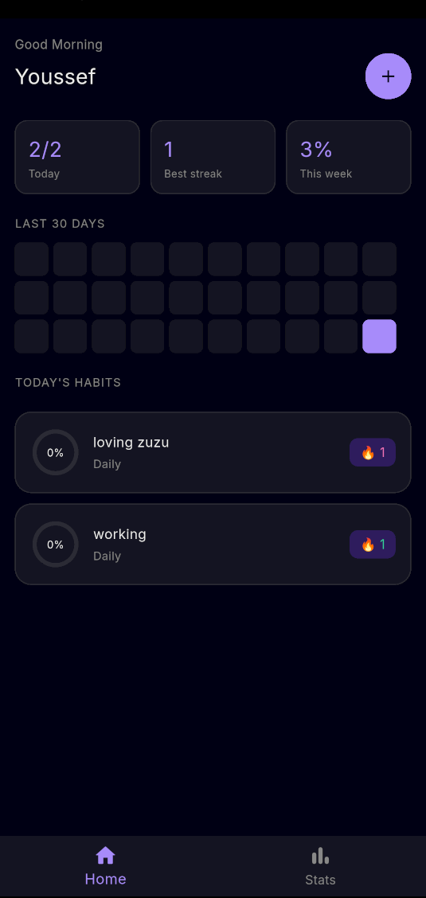
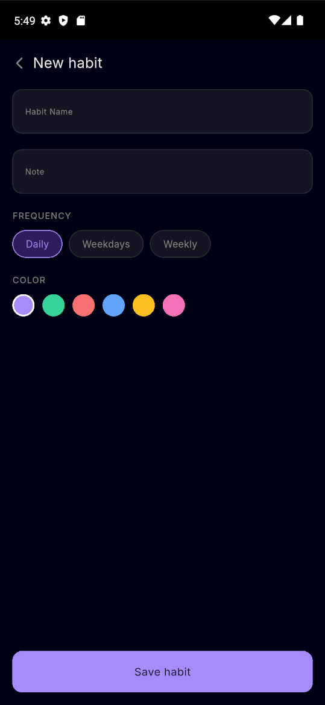
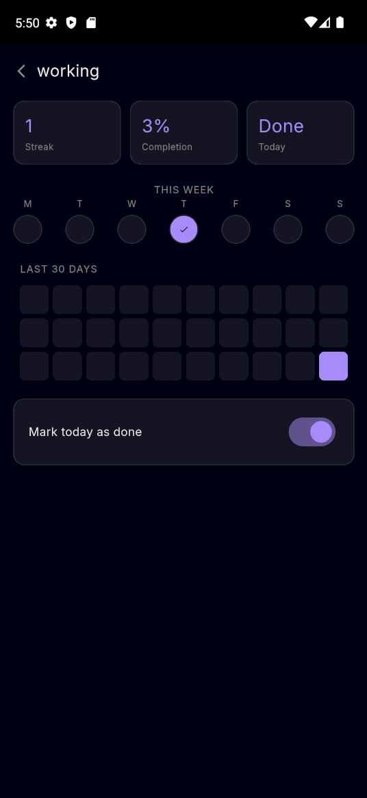
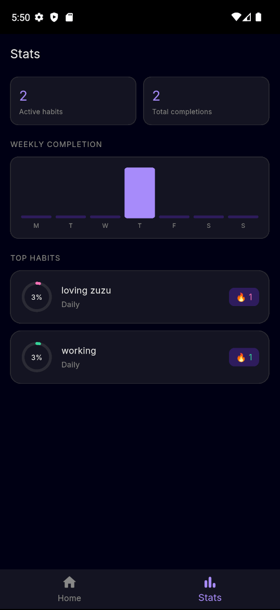

# Habit Tracker

A beautifully designed habit tracking app built with Flutter. Track your daily habits, visualize streaks, and build consistency over time.

## Screenshots

| Home             | Add Habit         | Detail               | Stats |
|------------------|-------------------|----------------------|-------|
|  |  |  |  |

## Features

- Create and manage daily habits
- Real-time streak tracking
- 30-day completion heatmap
- Weekly completion bar chart
- Color-coded habit categories
- Custom progress ring animations
- Persistent state with Riverpod

## Tech Stack

- **Flutter** — UI framework
- **Riverpod** — state management
- **CustomPainter** — custom progress ring drawing
- **Google Fonts** — Inter typography
- **Material 3** — design system

## Architecture

Feature-first folder structure with clean separation of concerns:
lib/
├── core/
│   └── theme/              # colors and theme configuration
├── features/
│   └── habits/
│       ├── data/           # models
│       ├── presentation/
│       │   ├── pages/      # home, add, detail, stats
│       │   └── providers/  # Riverpod state notifiers
└── shared/
└── widgets/            # reusable components

## Getting Started

```bash
git clone https://github.com/JoeOs97/habit_tracker.git
cd habit_tracker
flutter pub get
flutter run
```

Requires Flutter 3.x and Dart 3.x.

## Author

Built by Youssef — Flutter developer with 2+ years of experience.
[GitHub](https://github.com/JoeOs97)

## License

MIT